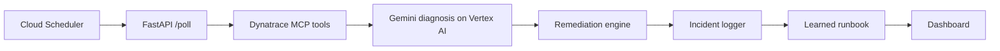

# OpsPilot

Autonomous incident response for the Dynatrace track of the Google Cloud Rapid Agent Hackathon.

OpsPilot monitors Dynatrace problems through MCP, gathers correlated entities, metrics, logs, and Davis context, asks Gemini on Vertex AI for a structured root-cause diagnosis, executes a targeted remediation action, and updates a learned runbook from incident outcomes.

## What It Does

- Detects new Dynatrace problems through an MCP polling loop.
- Retrieves grounding context from Google Cloud Agent Builder before diagnosis.
- Diagnoses incidents with Gemini on Vertex AI using Dynatrace, Davis, Agent Builder, and learned runbook context.
- Executes remediation actions such as Cloud Run scale requests, Pub/Sub alerts, and restart webhooks.
- Logs every incident and action for auditability.
- Learns runbook patterns from incident history.
- Serves a dashboard with live problems, incident history, MTTR trends, and learned patterns.

## Local Run

```powershell
python -m venv .venv
.\.venv\Scripts\Activate.ps1
pip install -r requirements.txt
cd web
npm install
npm run build
cd ..
uvicorn api.main:app --reload
```

Open `http://127.0.0.1:8000`.

Without cloud credentials, OpsPilot runs in demo mode using `tests/fixtures/sample_problem.json` and local JSON storage under `.opspilot/`.

## Cloud Configuration

Set these environment variables for a deployed build:

```text
GCP_PROJECT_ID=opspilot-hackathon-2026
GCP_LOCATION=us-central1
DYNATRACE_ENV_URL=https://your-environment.live.dynatrace.com
DYNATRACE_API_TOKEN_SECRET=DYNATRACE_API_TOKEN
DYNATRACE_ENV_URL_SECRET=DYNATRACE_ENV_URL
INCIDENT_BUCKET=opspilot-incidents
PUBSUB_TOPIC=opspilot-incidents
AGENT_BUILDER_ENGINE_ID=your-agent-builder-engine-id
RESTART_WEBHOOK_URL=https://example.internal/restart
```

## Architecture



## License

Apache-2.0
