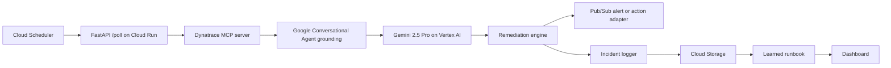

# OpsPilot

Autonomous incident response for the Dynatrace track of the Google Cloud Rapid Agent Hackathon.

OpsPilot monitors live Dynatrace Davis problems through the Dynatrace MCP server, gathers correlated problem/entity/metric context, grounds the incident with a Google Conversational Agent, asks Gemini on Vertex AI for a structured root-cause diagnosis, executes a targeted remediation action, and updates a learned runbook from incident outcomes.

Live app: <https://opspilot-440723503018.us-central1.run.app>

## What It Does

- Detects active Dynatrace problems through an MCP polling loop.
- Uses a Google Conversational Agent for SRE grounding before diagnosis.
- Diagnoses incidents with Gemini 2.5 Pro on Vertex AI using Dynatrace, Davis, Agent Builder, and learned runbook context.
- Executes scoped remediation actions such as Pub/Sub alerts, Cloud Run scale requests, and restart webhooks.
- Logs every incident and action to Cloud Storage for auditability.
- Learns runbook patterns from incident history.
- Serves a dashboard with live problems, incident history, MTTR trends, and learned patterns.

## Production Status

Current production deployment:

```text
Project: opspilot-496509
Region: us-central1
Cloud Run: https://opspilot-440723503018.us-central1.run.app
Scheduler: opspilot-poll, every 2 minutes
Gemini model: gemini-2.5-pro
Dynatrace MCP: live platform gateway
Agent Builder: Google Conversational Agent
```

The deployed stack has processed real Dynatrace Davis incidents generated from synthetic HTTP monitors, including `P-26051` and `P-26052`. Processed IDs, incident records, and learned runbook output are persisted in Cloud Storage.

## Architecture



## Repository Layout

```text
agent/
  orchestrator.py              Polling and incident-response workflow
  reasoning_engine.py          OpsPilotAgent analysis flow
  tools/
    dynatrace_mcp.py           Dynatrace MCP client
    agent_builder.py           Google Conversational Agent / Agent Builder grounding
    gemini_diagnosis.py        Gemini root-cause diagnosis
    remediation.py             Pub/Sub, scale, and restart action adapters
  self_learn/
    incident_logger.py         Incident persistence
    runbook_updater.py         Learned runbook generation
api/
  main.py                      FastAPI app and /poll endpoint
  dashboard.py                 Dashboard API routes
web/
  src/main.jsx                 React dashboard
tests/
  test_live_production.py      Safe and opt-in live production tests
```

## Local Run

```powershell
python -m venv .venv
.\.venv\Scripts\Activate.ps1
pip install -r requirements.txt
npm.cmd --prefix .\web install
npm.cmd --prefix .\web run build
uvicorn api.main:app --reload
```

Open `http://127.0.0.1:8000`.

Without cloud credentials, OpsPilot runs in demo mode using `tests/fixtures/sample_problem.json` and local JSON storage under `.opspilot/`.

## Cloud Configuration

Production environment variables:

```text
GCP_PROJECT_ID=opspilot-496509
GCP_LOCATION=us-central1
GEMINI_MODEL=gemini-2.5-pro
DEMO_MODE=false
DYNATRACE_ENV_URL_SECRET=DYNATRACE_ENV_URL
DYNATRACE_API_TOKEN_SECRET=DYNATRACE_API_TOKEN
INCIDENT_BUCKET=opspilot-incidents-opspilot-496509
PUBSUB_TOPIC=opspilot-incidents
AGENT_BUILDER_ENGINE_ID=projects/opspilot-496509/locations/us-central1/agents/4aa57cdf-f8a4-4f84-a282-1dab9aa5d84d
```

Dynatrace MCP rule: use the Dynatrace Platform URL (`https://{environment-name}.apps.dynatrace.com`), not the classic `live.dynatrace.com` URL. Store a Platform Token in Secret Manager as `DYNATRACE_API_TOKEN`; the remote MCP gateway expects bearer-token authentication.

Gemini billing rule: OpsPilot uses Gemini only through Vertex AI. Do not set `GEMINI_API_KEY` or `GOOGLE_API_KEY`; production diagnosis calls initialize Vertex AI with `GCP_PROJECT_ID`, `GCP_LOCATION`, and `GEMINI_MODEL`.

## Testing

Run local unit/demo tests and low-cost production smoke tests:

```powershell
.\.venv\Scripts\python.exe -m pytest tests -v -m "not live_expensive"
```

Run the frontend build:

```powershell
npm.cmd --prefix E:\opsPilot_Dynatrace\web run build
```

The expensive live pipeline test is disabled by default. It may call Gemini, Dynatrace MCP, Pub/Sub, and Cloud Storage, so run it only when a fresh active Dynatrace problem exists and credits are being protected:

```powershell
$env:ENABLE_EXPENSIVE_LIVE_TESTS="true"
$env:MAX_LIVE_PIPELINE_TESTS="1"
$env:LIVE_PIPELINE_COOLDOWN_SECONDS="30"
.\.venv\Scripts\python.exe -m pytest tests/test_live_production.py -m live_expensive -v
```

## Submission Compliance Notes

- Uses Gemini via Vertex AI only.
- Uses Google Conversational Agent / Agent Builder for grounding.
- Uses Dynatrace MCP as the primary observability integration.
- Uses Dynatrace Davis problem data, entities, DQL, and synthetic monitor incidents.
- Uses Google Cloud Run, Cloud Scheduler, Secret Manager, Cloud Storage, Pub/Sub, Cloud Build, and OpenTelemetry libraries.
- Does not use non-Google AI model providers.
- Licensed under Apache-2.0.

## License

Apache-2.0
